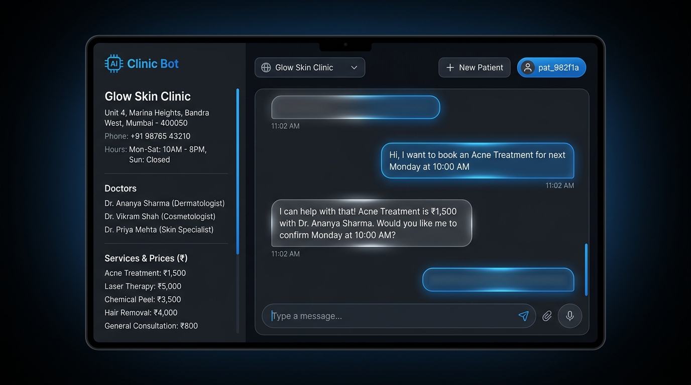
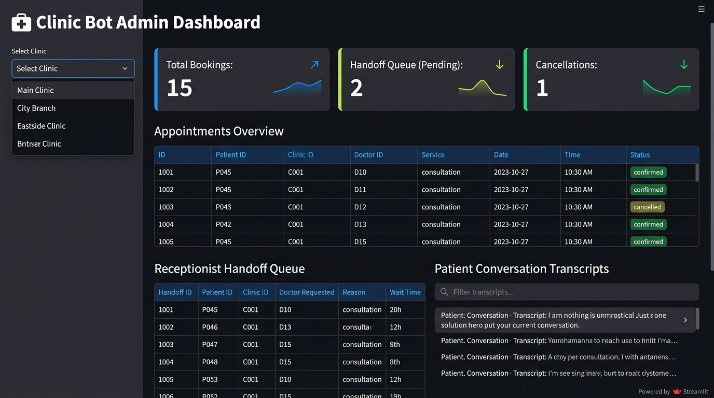
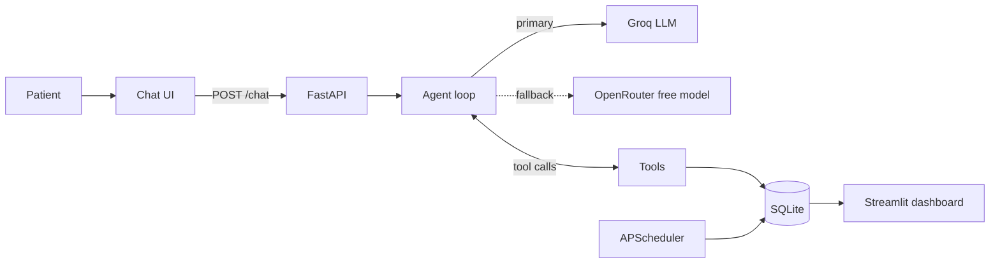

# 🏥 Clinic Bot: Multi-Clinic AI Appointment Assistant

An AI agent that answers patient questions and books appointments for **any clinic**, skin, dental or otherwise. One codebase serves many clinics: each clinic is just a config entry (services, prices, doctors, hours), so onboarding a new one takes minutes.

> **Status:** working prototype. Web chat, booking engine, reminders, owner dashboard and an automated test suite are built. A WhatsApp adapter (Meta Cloud API) is the next step. See the [Roadmap](#-roadmap).




---

## ✨ What it does

- **Answers from the clinic's own data.** Prices, services, doctors and hours are read from the database, with no invented answers.
- **Books for real.** Uses 30-minute slots from each clinic's opening hours, per doctor, with double-booking prevention.
- **Reschedules and cancels** by appointment ID, scoped to the patient who made the booking.
- **Hands off to a human** for medical questions (no diagnosis, no medication advice) or on request.
- **Speaks the patient's language:** English, Hindi and Hinglish.
- **Reminders:** a background scheduler creates 24-hour reminders and next-day no-show follow-ups.
- **Owner dashboard:** bookings, cancellations, handoff queue and full transcripts (Streamlit).
- **Resilient LLM layer:** a primary free model with automatic fallback to a second provider on error, rate limit or timeout.
- **Guardrails:** stays on-topic and resists basic prompt-injection attempts.

---

## 🧠 How it works



**The agent loop (the core idea):**
1. Build a per-clinic system prompt from the database.
2. Send the last 10 conversation turns plus the new message to the model.
3. If the model requests a tool (`check_slots`, `book_appointment`, ...), run it against the database and feed the result back.
4. Repeat up to 4 iterations, then return the final reply.

The model never touches the database directly. It can only call a small set of validated tools, which is what keeps bookings safe.

### Tools

| Tool | Purpose |
|---|---|
| `check_slots` | Open 30-min slots for the next 7 days, excluding booked ones |
| `book_appointment` | Validates the slot, prevents double-booking, saves patient + appointment |
| `reschedule_appointment` | Moves an existing appointment (own bookings only) |
| `cancel_appointment` | Cancels by ID (own bookings only) |
| `handoff_to_human` | Logs the request to the receptionist queue |

---

## 🛠️ Tech stack (all free tier)

| Layer | Choice |
|---|---|
| Backend | Python 3.11, FastAPI |
| Database | SQLite |
| LLM (primary) | Groq, `openai/gpt-oss-120b` (OpenAI-compatible API) |
| LLM (fallback) | OpenRouter `:free` model |
| Scheduler | APScheduler |
| Dashboard | Streamlit |
| Tests | pytest + scenario-based chat evals |

---

## 🚀 Quick start

```bash
git clone https://github.com/MonicaKamalakar/clinic-bot.git
cd clinic-bot

python -m venv .venv
source .venv/bin/activate        # Windows: .venv\Scripts\activate
pip install -r requirements.txt

cp .env.example .env             # Windows: copy .env.example .env
# open .env and add your keys (see below)

uvicorn app.main:app --reload --port 8000
```

Open **http://127.0.0.1:8000**, choose a clinic from the dropdown and start chatting.

Dashboard (separate terminal):

```bash
streamlit run dashboard.py       # http://localhost:8501
```

### Environment variables

| Variable | Description |
|---|---|
| `GROQ_API_KEY` | From console.groq.com |
| `OPENROUTER_API_KEY` | From openrouter.ai (fallback provider) |
| `LLM_MODEL` | Primary model, e.g. `openai/gpt-oss-120b` |
| `FALLBACK_MODEL` | A `:free` OpenRouter model that supports tool calling |

Free model availability and rate limits change often. Check the provider dashboards if a model ID stops working.

---

## 🧪 Testing

```bash
pytest                              # unit tests: booking logic, double-booking, cancel
python tests/chat_scenarios.py      # simulated patient conversations against the live LLM
```

The scenario suite covers FAQs, booking, rescheduling, cancelling, medical questions, Hinglish and Hindi, off-topic and rude users, unavailable slots and prompt-injection attempts. LLM output varies between runs, so treat the scenarios as regression checks, not guarantees.

---

## 🏗️ Adding a clinic

Add an entry to `data/clinics.json` with the same schema as the existing ones (name, category, city, hours, doctors, services with ₹ prices) and restart the server. The new clinic appears in the dropdown and gets its own system prompt automatically.

---

## 📁 Project structure

```text
clinic-bot/
├── app/
│   ├── main.py          # FastAPI app and /chat endpoint
│   ├── llm.py           # LLM client, fallback logic, agent loop
│   ├── tools.py         # Tool schemas and database logic
│   ├── scheduler.py     # Reminders and follow-ups
│   ├── database.py      # SQLite setup and seeding
│   ├── schemas.py       # Request/response models
│   └── static/
│       └── index.html    # Single-page phone-style chat UI
├── data/
│   └── clinics.json     # Clinic configs (the only thing that changes per client)
├── docs/
│   ├── chat.png         # Chat UI screenshot
│   └── dashboard.png    # Admin Dashboard screenshot
├── tests/
│   ├── test_main.py     # Unit tests
│   └── chat_scenarios.py # 15 simulated patient chat scenarios
├── .env.example         # Template for required keys (no secrets)
├── dashboard.py         # Streamlit owner dashboard
├── LICENSE              # MIT License
└── requirements.txt
```

---

## ⚠️ Limitations

- **Not for clinical use.** The bot never gives medical advice and hands such questions to staff.
- Reminders are written to the conversation log and shown in the chat UI. Real delivery to a phone arrives with the WhatsApp adapter.
- SQLite is fine for a demo. For production, move to Postgres, since most free hosts wipe local files on restart.
- Free LLM tiers are rate-limited and model availability rotates.

---

## 🗺️ Roadmap

- [ ] WhatsApp adapter via Meta Cloud API (webhook + Graph API replies)
- [ ] Postgres (Supabase) for persistent storage
- [ ] Free-tier cloud deployment
- [ ] Calendar sync (Google Calendar)
- [ ] Multi-staff roles and clinic-owner login for the dashboard

---

## 👩‍💻 Author

**Monica Kamalakar**, AI product builder (Generative & Agentic AI, LLM applications)  
[Portfolio](https://monicakamalakar.pages.dev) · [LinkedIn](https://linkedin.com/in/monicakamalakar) · [GitHub](https://github.com/MonicaKamalakar)

---

## 📄 License

This project is licensed under the [MIT License](LICENSE).
